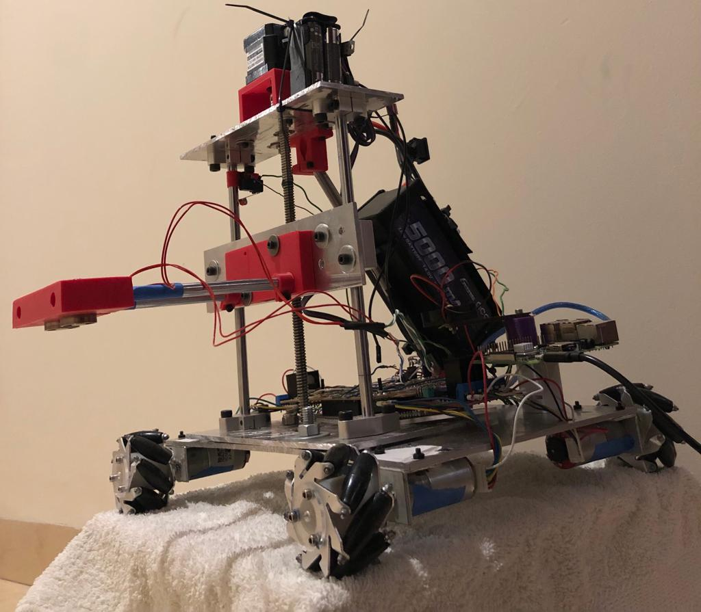
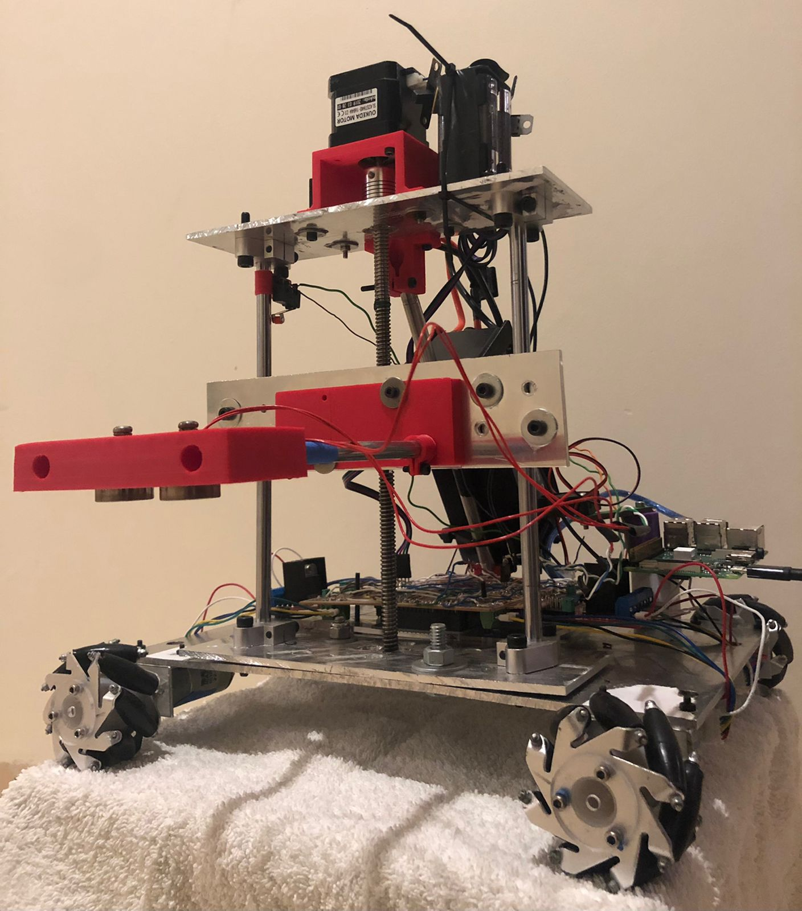
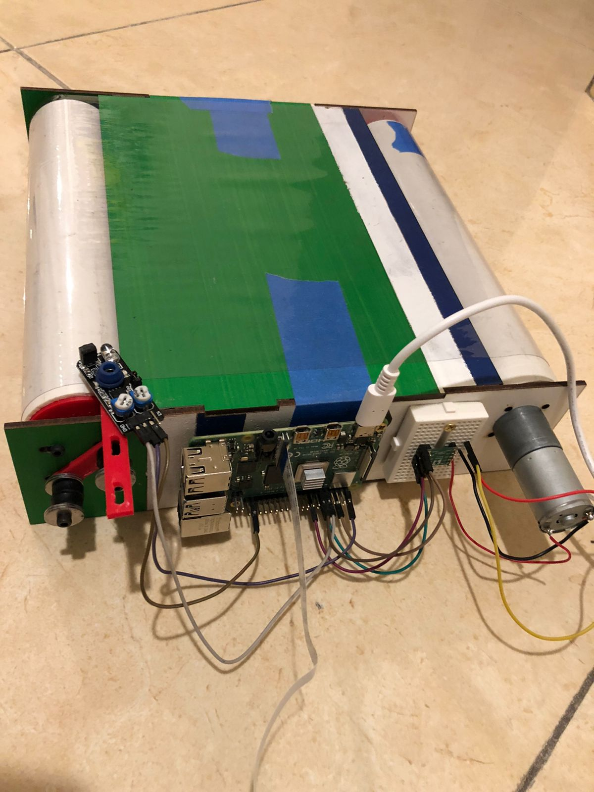
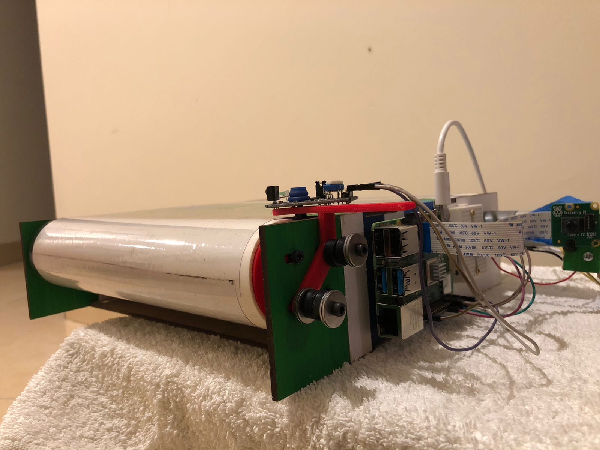
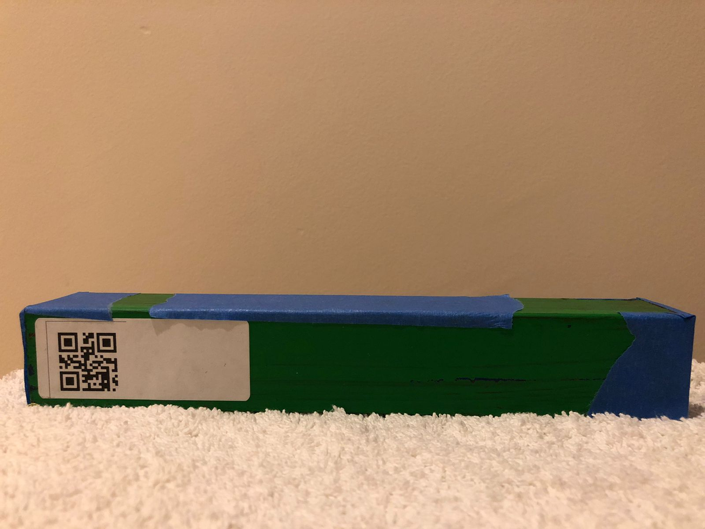
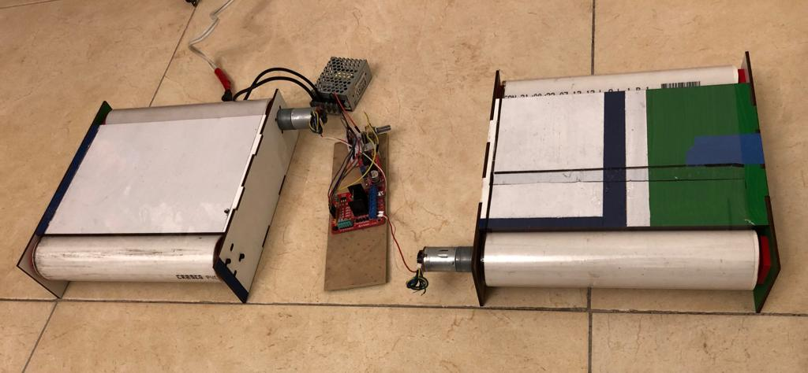
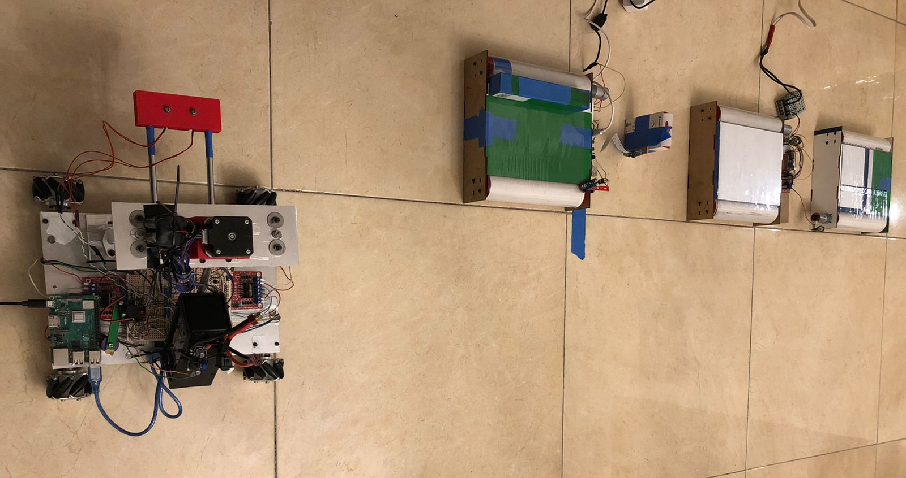
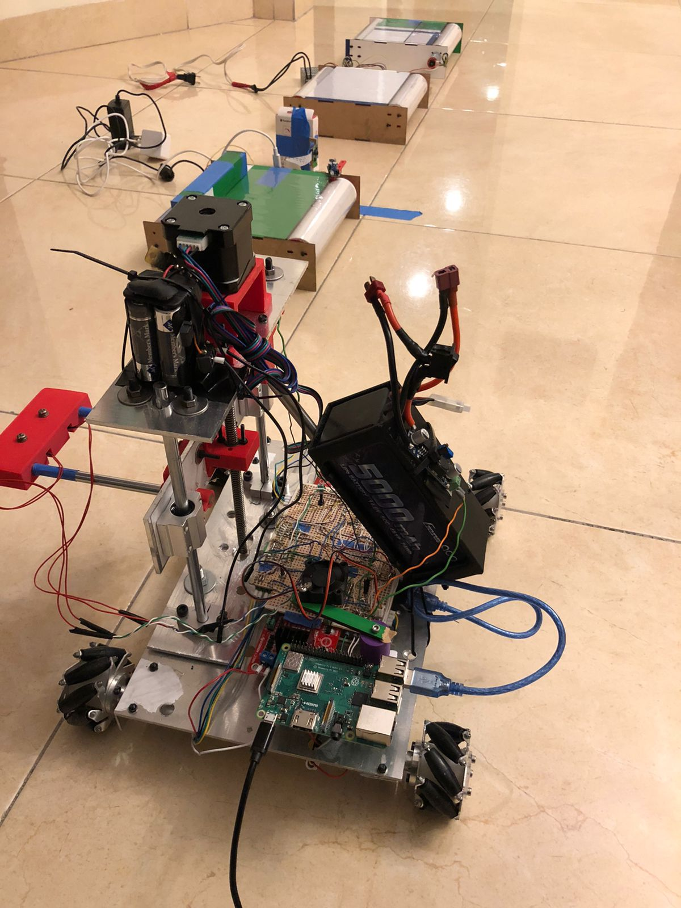

# Robot project

 The robot proyect named LARC consists of a container transporting system. The system is composed by a main robot that does all the transporting of the containers, a main conveyor belt that is in charge of identifying the containers' information and two transporting conveyors where the robot will place the already identified containers.

 The main robot is driven with onmidirectional wheels controlled by dc motors with encoders, it has a platform that it can move up or down with the help of a stepper motor and it contains electromagnets to attach the containers. The main circuit contains the necessary components and connections for the drivers and signals.

 To control the robot, the main program is loaded into an Arduino Mega, which is connected to a Raspberry Pi that has the necessary commads to send to the arduino through serial communication.

 The main conveyr belt is driven by a dc motor and even if it has encoders, they are not used. The main conveyor has another Raspberry Pi that has a Pi Camera attached to read the QR codes of the containers. It also has a sensor to indicate when a conveyr is waiting to be transported.

 The Raspberry Pi's communicate through a google cloud service from a spread sheet. Using the gspread library from python, the computers are able to manipulate the data from the sheet and read data from it.

 To start, the main conveyor will move a container until the sensor detects it. Once it has, it sends a signal to the spread sheet to tell the main robot to go pick up the container. The robot then reads the signal and moves towards the conveyor, it picks up the conveyor and places it in front of the camera. It then sends a signal that it is ready to scan. Which the main conveyor reads from the google sheet and it scans the QR code of the container. Once the operation is complete, it will store the information of the QR code in the spread sheet, keeping an inventory. The main robot can then read from the information on the QR code, where it should place the container, either band 1 or 2. Once it knows it places the container in the corresponding band and then returns to wait for another container.

# Repository structure

 The repo is devided into three main categories, each one has a folder. The first is the mechanical, where all the CAD files are included for the main robot and the conveyors.

 The second part is the electrical, where the circuit for the main robot and the conveyor, as well as the components necessary to build it can be found. 

 The last part consists of the code. The code is structured in classes, each class handles a specifc task for the robot. Inside it also has the main arduino code for the robot and the main python files for the conveyor and the robot.

# Robot and conveyors overview

## Main robot

## Main conveyor

## Steel container painted and with QR code

## Placement conveyors

## Complete placement
 

