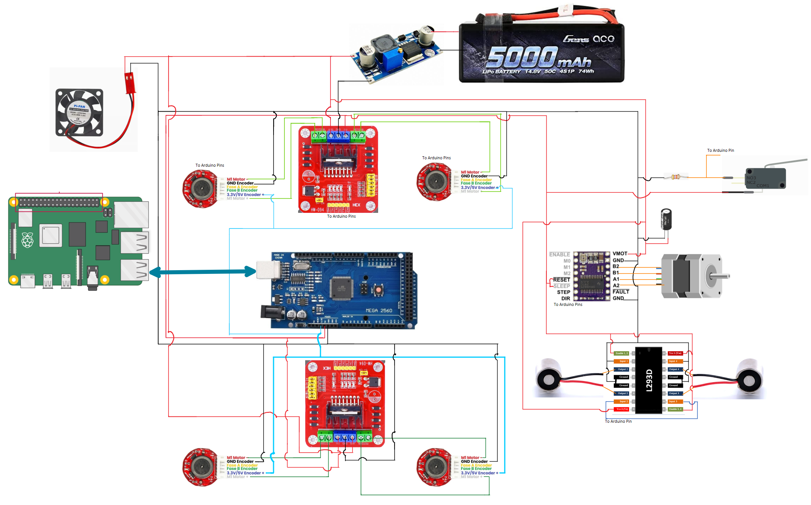

# Electrical
Most of the electrical materials to build the main robot and conveyor are in the excel file.

The electrial connections for all components of the main robot are as follow:

  

The only missing connections are for the GPIO pins of the arduino. They can be altered, bu the code shoudl be modified accordingly. The connections are as follows: 

  
- For the encoders in every motor:

  | Motor and phase |  Arduino Pin  | 
  | --------------- | ------------- |
  |     M1 ENCA     |       2       |
  |     M1 ENCB     |       53      |
  |     M2 ENCA     |       3       |
  |     M2 ENCB     |       52      |
  |     M3 ENCA     |       18      |
  |     M3 ENCB     |       51      |
  |     M4 ENCA     |       19      |
  |     M4 ENCB     |       50      |

- For the motor drivers:

  |   Driver and pin  |  Arduino Pin  | 
  | ----------------- | ------------- |
  |     D1 ENA M1     |       13      |
  |     D1 IN1 M1     |       12      |
  |     D1 IN2 M1     |       11      |
  |     D1 IN3 M2     |       48      |
  |     D1 IN4 M2     |       46      |
  |     D1 ENB M2     |       44      |
  |     D2 ENA M3     |       7       |
  |     D2 IN1 M3     |       6       |
  |     D2 IN2 M3     |       5       |
  |     D2 IN3 M4     |       47      |
  |     D2 IN4 M4     |       49      |
  |     D2 ENB M4     |       45      |

- For the stepper driver:

  | Stepper driver pin |  Arduino Pin  | 
  | ------------------ | ------------- |
  |        STEP        |       24      |
  |        DIR         |       22      |
  |        ENABLE      |       27      |

- For the limit switch, there are two pins the normally open (NO) and normally closed (NC). The wire that connects to the arduino is in between the resistor and the limit switch pin:
 
  |   Limit switch     |  Arduino Pin  | 
  | ------------------ | ------------- |
  |        NO          |       39      |

- For the electromagnets driver:
  | Electromagnet driver pin |  Arduino Pin  | 
  | ------------------------ | ------------- |
  |      Input 2 and 3       |       31      |
