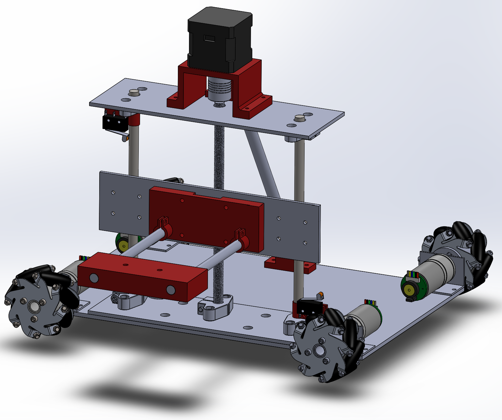
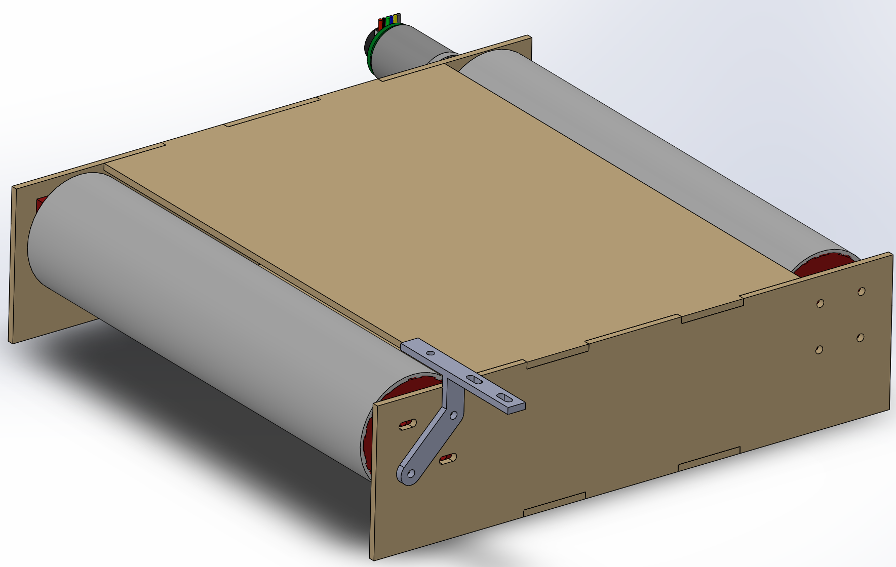

# Mechanical
Some important mechanical materials can be found in the excel file. Check the CAD files for further measurements and references.

All the CAD files are available in the zip folder, it also includes the CAD files for the conveyors.

The main robot design is as follows:

  

  
The conveyors were designed as follows:
  

  

